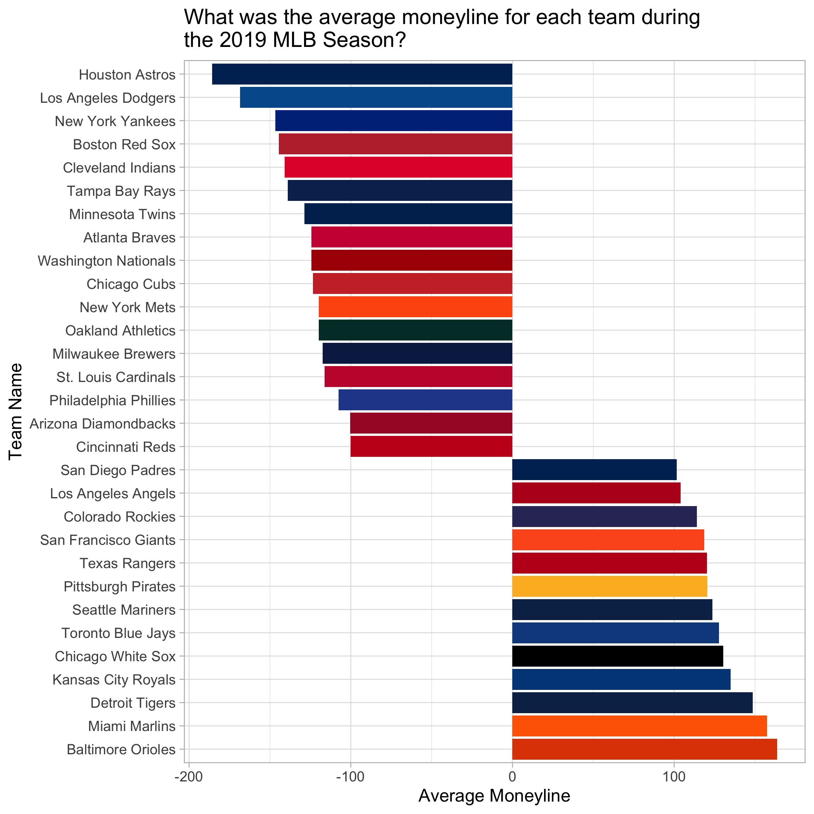

<!-- README.md is generated from README.Rmd. Please edit that file -->


# bettingtools

<!-- badges: start -->
<!-- badges: end -->

The bettingtools package has functions related to working with sports betting lines. First, we provide functions to work with American, Decimal, and Implied odds in the tidy format. Next, we provide functions to work with sports betting lines such as calculating zero-vig probabilities, theoretical hold, and the optimal single Kelly stake bet. Furthermore, the package comes with tidy datasets for historical NBA (work in progress), MLB, NFL (work in progress), and NHL (work in progress) Vegas lines for moneylines, point totals, and point spreads.

These functions take inspiration from posts by "Ganchrow" on the Sportsbook Review forum.

## Installation

``` r
remotes::install_github("pwu97/bettingtools")
```

## Analyze 2019 MLB Historical Odds

Inside the `bettingtools` package is the 2019 MLB historical odds dataset, `mlb_odds_2019`, where we can utilize functions in this package to answer interesting questions such as what was the average moneyline for games in the 2019 MLB season using a bar chart.


```r
library(bettingtools)
library(teamcolors)
library(tidyverse)
library(forcats)
theme_set(theme_light())

mlb_colors <- teamcolors::teamcolors %>%
  filter(league == "mlb") %>%
  rename(team = name) %>%
  select(team, primary)

away_team_lines <- mlb_odds_2019 %>%
  select(away_name, away_close_ml) %>%
  mutate(implied_ml = US2Implied(away_close_ml)) %>%
  rename(team = away_name) %>%
  select(team, implied_ml)

home_team_lines <- mlb_odds_2019 %>%
  select(home_name, home_close_ml) %>%
  mutate(implied_ml = US2Implied(home_close_ml)) %>%
  rename(team = home_name) %>%
  select(team, implied_ml)

avg_2019_mlb_ml <- rbind(away_team_lines, home_team_lines) %>%
  group_by(team) %>%
  summarize(avg_implied_ml = mean(implied_ml),
            avg_ml_line = Implied2US(mean(implied_ml))) %>%
  left_join(mlb_colors, by = "team") %>%
  arrange(desc(avg_ml_line)) %>%
  slice(-n()) %>%
  mutate(team = fct_reorder(team, avg_ml_line, .desc = TRUE),
         primary = fct_reorder(primary, avg_ml_line, .desc = TRUE)) %>%
  ungroup()

# Generate moneyline bar chart
mlb_2019_ml_chart <- avg_2019_mlb_ml %>%
  ggplot(aes(x = team, y = avg_ml_line, label = avg_ml_line)) +
  geom_col(fill = avg_2019_mlb_ml$primary) +
  coord_flip() +
  labs(y = "Average Moneyline",
       x = "Team Name",
       title = "What was the average moneyline for each team during\nthe 2019 MLB Season?")
```



We can also, for example, calculate the average over/under movement, the average away/home closing moneyline, and whether the closing moneylines are sharper than the opening moneylines given by Vegas, on average. We can see that home teams tended to be favored more often, on average, than away teams. Furthermore, there is also evidence that closing moneylines were indeed sharper than opening moneylines by about 2%.


```r
# What is the average O/U movement for games in which there was line movement?
mlb_odds_2019 %>%
  mutate(ou_movement = close_ou_line - open_ou_line) %>%
  filter(ou_movement != 0) %>%
  summarize(mean_ou_movement = mean(ou_movement)) %>%
  pull(mean_ou_movement)
#> [1] -0.01659751

# What is the average away closing moneyline?
mlb_odds_2019 %>%
  mutate(away_implied = US2Implied(away_close_ml)) %>%
  summarize(avg_away_closing_ml = Implied2US(mean(away_implied))) %>%
  pull(avg_away_closing_ml)
#> [1] 109.7098

# What is the average home closing moneyline?
mlb_odds_2019 %>%
  mutate(home_implied = US2Implied(home_close_ml)) %>%
  summarize(avg_home_closing_ml = Implied2US(mean(home_implied))) %>%
  pull(avg_home_closing_ml)
#> [1] -119.2058

# Are closing moneylines sharper than opening moneylines?
mlb_odds_2019 %>%
  mutate(fav_team_won_open = ifelse((((away_score > home_score) & (away_open_ml < home_open_ml)) | ((away_score < home_score) & (away_open_ml > home_open_ml))), 1, 0),
         fav_team_won_close = ifelse((((away_score > home_score) & (away_close_ml < home_close_ml)) | ((away_score < home_score) & (away_close_ml > home_close_ml))), 1, 0)) %>%
  summarize(pct_fav_team_won_open = mean(fav_team_won_open, na.rm = TRUE),
            pct_fav_team_won_close = mean(fav_team_won_close, na.rm = TRUE),
            pct_diff = pct_fav_team_won_close - pct_fav_team_won_open)
#> # A tibble: 1 x 3
#>   pct_fav_team_won_open pct_fav_team_won_close pct_diff
#>                   <dbl>                  <dbl>    <dbl>
#> 1                 0.573                  0.592   0.0191
```

## Calculate single Kelly stake

We can calculate the percentage of one's bankroll one should bet to maximize the expected growth of one's bankroll on a single bet. Given an expected win probability, payout odds, and an optional Kelly multiplier factor, we can calculate one's optimal single Kelly stake. Note that default odds for the expected win probability is implied probability ("prob") and the default odds for the payout is in decimal ("dec"). We can change them accordingly to how we see fit by specifying additional parameters in our function ("prob", "dec", "us").


```r
library(bettingtools)

calculateKellyStake(0.53, 1.92)
#> [1] 0.0191

calculateKellyStake(0.41, 2.56)
#> [1] 0.0318

# Getting a bet at +150 when it is expected to hit at -120
calculateKellyStake(-120, 150, expected_odds = "us", payout_odds = "us")
#> [1] 0.2425

# Getting a bet at -150 when expected probability is 70% at a 10% kelly multiplier.
calculateKellyStake(0.70, -150, kelly_multiplier = 0.1, payout_odds = "us")
#> [1] 0.0252

# Optimal move is to not place a bet
calculateKellyStake(0.26, -110, payout_odds = "us")
#> [1] 0
```

## Calculate all possible win-loss outcomes given probabilities

We return a tibble where each row is one possible outcome we can observe from a list of given probabilities.


```r
calculateWinRanges(c(.1, .4, .88, .47))
#> # A tibble: 5 x 3
#>       W     L Probability
#>   <int> <int>       <dbl>
#> 1     0     4      0.0343
#> 2     1     3      0.309 
#> 3     2     2      0.445 
#> 4     3     1      0.195 
#> 5     4     0      0.0165

calculateWinRanges(c(.12, .462, .29))
#> # A tibble: 4 x 3
#>       W     L Probability
#>   <int> <int>       <dbl>
#> 1     0     3      0.336 
#> 2     1     2      0.472 
#> 3     2     1      0.176 
#> 4     3     0      0.0161

calculateWinRanges(c(.6, .6, .6, .6))
#> # A tibble: 5 x 3
#>       W     L Probability
#>   <int> <int>       <dbl>
#> 1     0     4      0.0256
#> 2     1     3      0.154 
#> 3     2     2      0.346 
#> 4     3     1      0.346 
#> 5     4     0      0.130
```


## Calculate zero-vig implied probabilities

We can calculate the zero-vig implied probabilities of a vector of lines. The default precision is set to 4 digits. Note that we can set the precision.


```r
calculateZeroVigProb(c(200, -180, -450, 800))
#> [1] 0.3333 0.6429 0.8182 0.1111

calculateZeroVigProb(-237)
#> [1] 0.7033

calculateZeroVigProb(-237, precision = 7)
#> [1] 0.7032641
```

##  Calculate implied probabilities for two-outcome line set

We can calculate the implied probabilities for two lines by first calculating the zero-vig implied probabilities for both of them, and then normalizing them. Again, we can set the precision. 


```r
calculateImpliedProbPair(c(200, -220))
#> [1] 0.3265 0.6735

calculateImpliedProbPair(c(1000, -800))
#> [1] 0.0928 0.9072

calculateImpliedProbPair(c(1000, -800), precision = 7)
#> [1] 0.0927835 0.9072165
```

## Calculate theoretical hold

We can calculate the theoretical hold for a two-outcome line set. This corresponds to the profit a sportsbook would expect to make were a player to bet on either side of an event with all else being equal. Contrary to popular belief, larger nominal spreads doesn't necessarily mean more profit for bookies.


```r
calculateTheoreticalHold(c(-110, -110))
#> [1] 0.0454

calculateTheoreticalHold(c(-1500, 875))
#> [1] 0.0386

calculateTheoreticalHold(c(-1500, 875), precision = 7)
#> [1] 0.038554
```

## Convert American or Decimal Odds to Zero-Vig Fair Odds

We can convert a pair of American or Decimal odds to the fair zero-vig counterpart by calculating the individual zero-vig probabilities and then normalizing them. 


```r
US2Fair(c(265, -375))
#> [1]  288.1988 -288.1988

US2Fair(c(150, -200))
#> [1]  166.6667 -166.6667

Dec2Fair(c(2.14, 1.86))
#> [1]  115.0538 -115.0538

Dec2Fair(c(4.00, 1.51))
#> [1]  264.9635 -264.9635
```

## Converting between American, Decimal, and Implied Odds

We can convert between American, Decimal, and Implied Odds.


```r
US2Implied(c(-250, 600, 137, -110))
#> [1] 0.7143 0.1429 0.4219 0.5238

US2Dec(c(-250, 600, 137, -110))
#> [1] 1.40 7.00 2.37 1.91

US2All(c(-250, 600, 137, -110))
#> # A tibble: 4 x 3
#>   American Decimal Implied
#>      <dbl>   <dbl>   <dbl>
#> 1     -250    1.4    0.714
#> 2      600    7      0.143
#> 3      137    2.37   0.422
#> 4     -110    1.91   0.524

Dec2Implied(c(3.17, 2.14, 2.01, 1.67))
#> [1] 0.3155 0.4673 0.4975 0.5988

Dec2US(c(3.17, 2.14, 2.01, 1.67))
#> [1]  217.0000  114.0000  101.0000 -149.2537

Dec2All(c(3.17, 2.14, 2.01, 1.67))
#> # A tibble: 4 x 3
#>   American Decimal Implied
#>      <dbl>   <dbl>   <dbl>
#> 1     217     3.17   0.316
#> 2     114     2.14   0.467
#> 3     101     2.01   0.498
#> 4    -149.    1.67   0.599

Implied2Dec(c(.34, .54, .88, .12))
#> [1] 2.94 1.85 1.14 8.33

Implied2US(c(.34, .54, .88, .12))
#> [1]  194.1176 -117.3913 -733.3333  733.3333

Implied2All(c(.34, .54, .88, .12))
#> # A tibble: 4 x 3
#>   American Decimal Implied
#>      <dbl>   <dbl>   <dbl>
#> 1     194.    2.94    0.34
#> 2    -117.    1.85    0.54
#> 3    -733.    1.14    0.88
#> 4     733.    8.33    0.12
```

